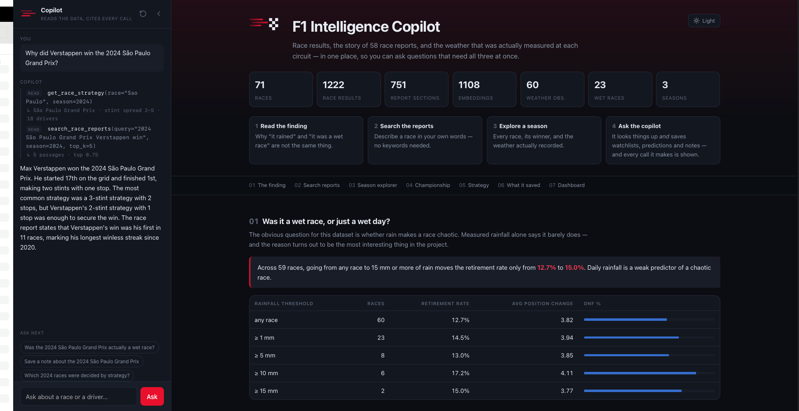
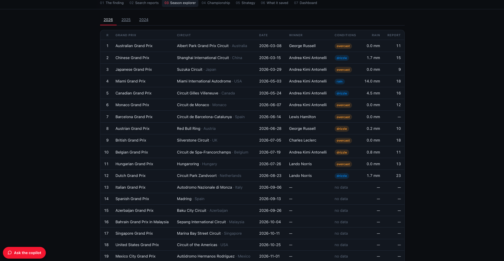
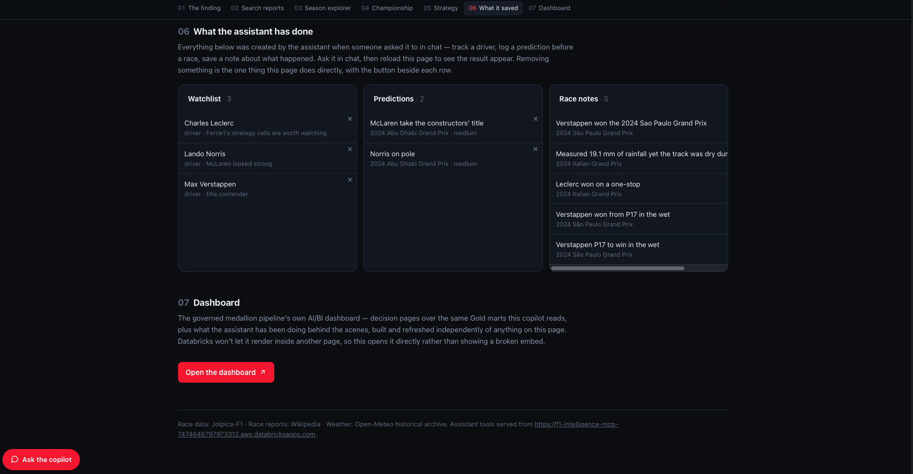
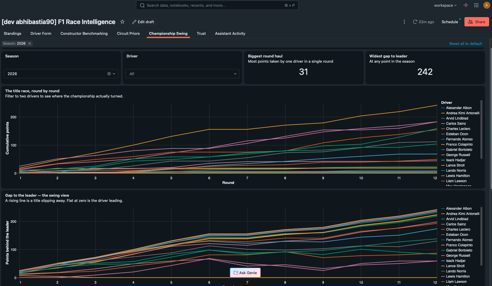
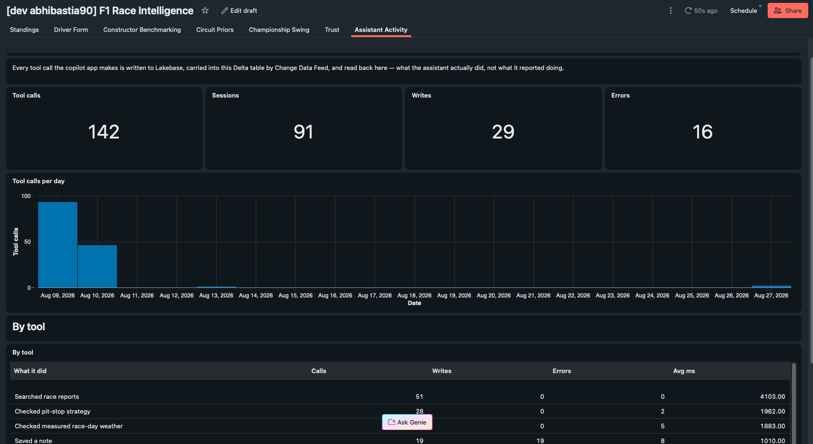
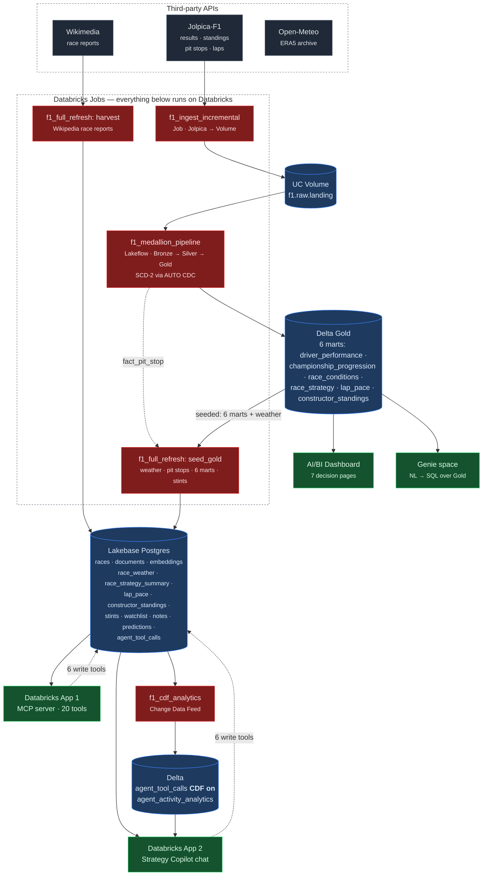

# F1 Intelligence Copilot

[](https://github.com/abhibastia/f1-intelligence-copilot/actions/workflows/tests.yml)

A governed Formula 1 data platform and an agentic strategy copilot, merged into
one system. Three public APIs → Unity Catalog Volume → a Lakeflow Declarative
Pipeline (Bronze → Silver → Gold) → **three ways to ask it questions**: an
AI/BI dashboard, a Genie natural-language space over Gold, and a chat copilot
backed by Lakebase Postgres with retrieval over race-report prose and a set of
read/write agent tools exposed over MCP.

This platform grew from two originally-separate projects, later merged into
one system: a governed medallion pipeline (dashboard and Genie —
[`docs/architecture.md`](docs/architecture.md)) and a Lakebase-backed strategy
copilot (retrieval and agent — [`docs/copilot_design.md`](docs/copilot_design.md)).

Both apps run behind Databricks OAuth on Free Edition, so there's no public
URL to click through — these are what they look like running:

<table>
<tr>
<td width="50%"><br><sub>The finding — RAG grounded in race-report prose, cited inline</sub></td>
<td width="50%"><br><sub>Season Explorer — governed Gold marts, served from Lakebase</sub></td>
</tr>
<tr>
<td width="50%"><br><sub>What it saved — watchlist, predictions, notes, all written by the agent's own tools</sub></td>
<td width="50%"><br><sub>AI/BI Dashboard — Championship Swing, one of 7 decision pages over Gold</sub></td>
</tr>
</table>

<br><sub>Assistant Activity — every tool call the copilot makes, carried into Delta via Change Data Feed and surfaced back in the dashboard</sub>

---

## 1. What it does and why

After a Grand Prix the interesting question is never *what* happened — the
results table answers that in a line. It is **why**. *Why did Ferrari lose a
race they led? Was an undercut the right call, or did the safety car simply
fall their way? Which races were actually decided by strategy rather than
pace?*

Answering that means holding three incompatible sources together:

| Source | Answers | Cannot answer |
|---|---|---|
| Results and timing | *what* happened, precisely | *why* |
| Race report prose | *why*, in expert language | anything numeric or comparable |
| Weather records | the conditions | **when**, within the race, they mattered |

This project joins all three on `(season, round)`: a governed pipeline makes
the numbers trustworthy, and an agent sits in front of all three sources at
once.

### The finding that shaped the design

Rain looks like it should cause chaos. Across the seasons in this dataset,
moving from *any race* to *heavy rain* barely moves the retirement rate — the
wettest race on record was among the calmest. A weather archive reports a
**daily total** and cannot distinguish rain that fell overnight from rain that
fell during the race. The narrative can: semantic search over race reports
surfaces sentences like *"although rain had fallen earlier on Sunday, the track
was dry by the time the race began."*

**This is why the embeddings are load-bearing rather than decorative.** Delete
them and the product cannot answer its own core question, because causation
lives in the prose. See [`docs/copilot_design.md`](docs/copilot_design.md) for
the full reasoning, and [`docs/architecture.md`](docs/architecture.md) for how
the pipeline underneath it is built and quality-checked.

---

## 2. Architecture



**Dataflow in one line:** three APIs → governed Spark medallion (Delta) + a
Databricks job harvesting Wikipedia → three read surfaces off Gold (dashboard, Genie, Lakebase) →
agent reads and writes Lakebase → tool calls flow back to Delta through Change
Data Feed → surfaced in the chat app.

**Why Lakebase in addition to Gold.** Delta is analytical, Lakebase is
operational. Free Edition's daily compute quota is unrecoverable until the next
day, so an agent that spends a warehouse query per question dies mid-demo. All
six Gold marts are seeded into Postgres once — a handful of warehouse queries
total — and every agent read after that is free. The dashboard and Genie still
read Gold directly, because they are occasional, human-paced queries rather
than a per-turn cost.

---

## 3. Repository layout

| Path | What | Layer |
|---|---|---|
| `src/ingestion/`, `src/pipeline/` | **Governed Spark medallion**: ingestion, Bronze→Gold (6 marts), SCD-2 | Pipeline |
| `sql/` | Validation checks, data-quality event-log queries, the `driver_metrics` metric view | Pipeline |
| `dashboards/` | AI/BI dashboard definition — 7 decision pages | Pipeline |
| `genie/` | Genie space scoped to Gold + the metric view | Pipeline |
| `docs/architecture.md` | Pipeline design record and data dictionary | Pipeline |
| `docs/copilot_design.md` | Agent/RAG design record | Copilot |
| `docs/runbook.md` | Operations and failure modes | Pipeline |
| `harvest/` | Wikipedia race reports — runs as a Databricks job (`jobs/run_harvest.py`) or locally for testing | Copilot |
| `f1lake/` | Lakebase schema, loaders, embedding, Gold→Lakebase seeding | Copilot |
| `jobs/` | Databricks job entry points for harvest, embed, seed_gold | Copilot |
| `mcp_server/` | MCP server app — 20 tools over streamable HTTP | Copilot |
| `app/` | Strategy Copilot app — frontend, in-process agent, dashboards | Copilot |
| `notebooks/` | CDF→Delta analytics job | Copilot |
| `resources/`, `databricks.yml` | One Asset Bundle: pipeline, jobs, dashboard | Shared |
| `scripts/` | Catalog provisioning, access control, bootstrap, app build, validation | Shared |
| `tests/` | Pipeline contract tests, agent/resolution tests, bundle checks | Shared |
| `data/` | Harvested source data (gitignored except demo transcripts) | Shared |

---

## 4. Setup

### 4.1 Prerequisites

- Databricks Free Edition workspace, **identity verified** (unlocks outbound
  internet for in-platform API calls)
- Databricks CLI ≥ 0.294, authenticated: `databricks auth login --profile <profile>`
- Python 3.11+ locally
- A Unity Catalog catalog named `f1`
  (**Free Edition cannot create catalogs over the API** — make it once in the
  UI: Catalog → Create catalog → `f1` → Default storage)

### 4.2 Lakebase

The serving store. Create a project, add a role you control the password for,
and note the endpoint host:

```bash
PROJECT=f1-copilot
databricks postgres create-project $PROJECT \
  --json '{"spec": {"display_name": "F1 Intelligence Copilot"}}' --profile <profile>
databricks postgres list-branches  projects/$PROJECT --profile <profile>
databricks postgres list-endpoints projects/$PROJECT/branches/production --profile <profile>
```

Take `status.hosts.host` from the endpoint — that is `<host>`. Then create a
**native Postgres role** with a password (short-lived OAuth credentials expire
after an hour, which is a bad fit for a long-running app):

```bash
databricks postgres create-role projects/$PROJECT/branches/production <role> \
  --json '{"spec": {"password": "<password>"}}' --profile <profile>
```

`ensure_schema()` (§5, Step 4) creates every table, index, and the two
extensions it needs — `vector` for embeddings and `unaccent` for name matching.

### 4.3 Secrets

One secret: a base64-encoded Postgres connection URL.

```bash
databricks secrets create-scope database --profile <profile>
printf 'postgresql://<role>:<password>@<host>:5432/databricks_postgres?sslmode=require' \
  | base64 \
  | databricks secrets put-secret database lakebase-url --profile <profile>
```

Both apps also need read access on this scope — their service principals don't
exist until the apps are created, so that grant is Step 3b in §5.

### 4.4 Environment variables

Copy [`.env.example`](.env.example). No API keys exist in this project —
Jolpica, Wikimedia and Open-Meteo are all free and keyless.

### 4.5 Local environment

```bash
python3 -m venv .venv && .venv/bin/pip install -r requirements-dev.txt
export DATABRICKS_CONFIG_PROFILE=<profile>
```

### 4.6 Runtime

Everything is **serverless** — no cluster to size. The Lakeflow pipeline and
the jobs run on serverless compute; the apps run on Databricks Apps compute.

---

## 5. Running each component end to end

### Step 1 — Governed pipeline (Databricks)

```bash
./scripts/create_catalog.sh                        # schemas + landing Volume
databricks bundle validate --strict -t dev --profile <profile>
databricks bundle deploy -t dev --profile <profile>
databricks bundle run f1_ingest_incremental -t dev --profile <profile>
databricks bundle run f1_medallion_pipeline -t dev --profile <profile>
```

The ingest job calls Jolpica **from inside Databricks** and lands raw JSON in
`f1.raw.landing`; the Lakeflow pipeline reads it through Bronze → Silver → Gold,
producing all six Gold marts. Writes are idempotent, so a re-run costs a
handful of API calls, not hundreds.

To backfill locally instead: `python3 src/ingestion/ingest.py --mode backfill
--root ./landing`, then `./scripts/upload_landing.sh`.

After changing pipeline code, run the gated version instead of the two
`bundle run` lines above — it brackets the same ingest + pipeline work with a
unit-test task before and `validate_marts.py` after, so a typo fails in
seconds rather than after a cluster start, and "the update completed" only
counts once the marts actually reconcile:

```bash
databricks bundle run f1_end_to_end -t dev --profile <profile>
```

Deliberately unscheduled — see `resources/f1_end_to_end.job.yml` — it costs
roughly twice the daily quota of `f1_ingest_incremental`, so it runs on
request, not on a schedule.

### Steps 2–3 — Harvest, embed and seed Lakebase (on Databricks)

The whole Lakebase-serving layer — Wikipedia harvest, embedding, and seeding
all six Gold marts (plus weather, pit stops and derived stints) — runs as one
Databricks job:

```bash
databricks bundle run f1_full_refresh -t dev --profile <profile>
```

`harvest` writes each race to Lakebase immediately after fetching it, so a
retry only re-fetches what's missing; `embed` and `seed_gold` need no
`--profile` at all — they authenticate as the job's own runtime identity. See
`resources/f1_jobs.yml` for what's verified and why (short version: it used to
crash with a generic "Python process exited unexpectedly" that turned out to
be `psycopg2-binary`'s compiled OpenSSL colliding with the serverless
runtime's own native extensions — fixed by switching to `pg8000`, a
pure-Python driver).

**For local testing only**, the same modules run standalone:

```bash
python3 -m harvest.run                   # Wikipedia race reports
python3 -m f1lake.load                   # chunk, embed, load to Lakebase
python3 -m f1lake.load_strategy          # derive stints (after seed_gold)
python3 -m f1lake.seed_gold --profile <profile>   # weather, pit stops, six marts
```

or the whole thing at once: `python3 scripts/full_refresh.py`.

### Step 4 — Deploy the two apps

```bash
databricks apps create f1-intelligence-mcp --profile <profile>
databricks apps create f1-intelligence-ui  --profile <profile>

for APP in f1-intelligence-mcp f1-intelligence-ui; do
  SP=$(databricks apps get "$APP" --profile <profile> -o json \
        | python3 -c 'import json,sys; print(json.load(sys.stdin)["service_principal_client_id"])')
  databricks secrets put-acl database "$SP" READ --profile <profile>
done

./scripts/build_app.sh mcp_server && ./scripts/build_app.sh app
databricks sync mcp_server /Workspace/Users/<you>/f1-intelligence-mcp --profile <profile> --full
databricks apps start  f1-intelligence-mcp --profile <profile>
databricks apps deploy f1-intelligence-mcp \
  --source-code-path /Workspace/Users/<you>/f1-intelligence-mcp --profile <profile>
# repeat for app/ → f1-intelligence-ui
```

`app/app.yaml`'s `MCP_SERVER_URL` is only the footer link, but replace it with
your own MCP app's URL and redeploy.

### Step 5 — Change Data Feed analytics

Runs automatically as the last task of `f1_full_refresh` (Steps 2–3), or on
its own:

```bash
databricks bundle run f1_cdf_analytics -t dev --profile <profile>
```

`cdf_job.json` / `databricks jobs submit` is no longer needed — it existed
because this notebook used to crash under `bundle run` specifically, which
turned out to be the same `psycopg2` issue as Steps 2–3, fixed the same way.
See `resources/f1_jobs.yml` for the full story if you're curious.

### Step 6 — Genie

```bash
databricks workspace mkdirs /Workspace/Users/<you>/genie_spaces --profile <profile>
databricks genie create-space --profile <profile> --json "{
  \"warehouse_id\": \"<warehouse-id>\",
  \"title\": \"F1 Intelligence — Gold\",
  \"parent_path\": \"/Workspace/Users/<you>/genie_spaces\",
  \"serialized_space\": $(python3 -c 'import json;print(json.dumps(open("genie/f1_gold_space.json").read()))')
}"
```

Scoped to Gold only, deliberately: point a natural-language agent at Silver and
it will join a driver to their *current* team and report a past result under
the wrong constructor.

### Step 7 — Tests

```bash
.venv/bin/python -m pytest -q                              # everything runnable locally
.venv/bin/python -m pytest -q -m "not integration"          # skips the live-Lakebase tests
```

Tests marked `integration` open a real Lakebase connection and clean up every
row they write. `tests/spark/` needs a real Spark session and runs on
Databricks as the first task of `f1_end_to_end`, not locally.

Lint/format is `ruff` (config in `pyproject.toml`). `pip install -r
requirements-dev.txt && pre-commit install` runs it on every commit; CI runs
the same check.

### Step 8 — Access control and one-command refresh

```bash
python3 scripts/apply_grants.py --profile <profile> --dry-run
python3 scripts/full_refresh.py --dry-run       # what would run, and current counts
python3 scripts/full_refresh.py --with-spark    # Gold seed + CDF job included
```

---

## 6. The agent

**20 tools — 14 read, 6 write.** Full definitions in
[`mcp_server/f1_mcp_server.py`](mcp_server/f1_mcp_server.py); the in-app agent
uses the same `f1_broker` functions so both surfaces run identical code.

| Read | Write |
|---|---|
| `get_driver_season` · `compare_constructors` | **`add_to_watchlist`** · **`remove_from_watchlist`** |
| `get_championship_standings` · `get_constructor_standings` | **`log_prediction`** · **`delete_prediction`** |
| `get_race_weather` · `find_wet_races` | **`save_race_note`** · **`delete_note`** |
| `search_race_reports` |  |
| `get_race_strategy` · `find_strategy_races` |  |
| `get_race_pace` |  |
| `get_season_schedule` |  |
| `get_watchlist` · `get_predictions` · `get_race_notes` |  |

`get_constructor_standings` and `get_race_pace` are new capability this merge
adds — both read Gold marts (`constructor_standings`, `lap_pace`) the
standalone copilot never seeded into Lakebase at all.

**Guardrails.** Never state a figure not returned by a tool; follow the
`suggestion` field on an error rather than guessing; report what a name
resolved to, so a wrong match is visible; treat missing weather as *no data*,
never as *fair weather*.

Every answer in the chat app shows the calls that produced it **and what each
one returned**, and writes are marked in red with the stored row id. Full
detail — including the guardrail examples — in
[`docs/copilot_design.md`](docs/copilot_design.md) §11–13.

---

## 7. Unstructured data and retrieval

Wikipedia race reports, chunked and embedded (`all-MiniLM-L6-v2`, 384-dim) in
Lakebase `pgvector`, HNSW with `vector_cosine_ops` to match the `<=>` operator
used at query time.

Wired into queries in `f1_broker.search_reports`, which joins each hit to that
race's measured weather — sourced from Gold's `race_conditions` mart, not a
second fetch — so narrative and measurement can be checked against each other.

---

## 8. Change Data Feed loop

```
Lakebase agent_tool_calls          agent writes here on every tool call
   │  MERGE, idempotent on id
   ▼
f1.gold.agent_tool_calls           Delta, delta.enableChangeDataFeed = true
   │  table_changes()
   ▼
f1.gold.agent_activity_analytics   per-tool calls, writes, errors, latency
   │
   ▼  app "Agent activity" section
```

This is distinct from the medallion pipeline's own CDC (SCD-2 via
`create_auto_cdc_flow`) and from the pipeline's decision **not** to enable CDF
on its own Silver/Gold tables, which are materialized views and cannot support
it — that decision applies to the pipeline's Delta tables, not to this plain,
streaming-compatible `agent_tool_calls` table.

---

## 9. Known limitations

- **Tyre compounds do not exist in this data.** Jolpica inherits Ergast's
  schema, which has no compound field. Tyre strategy is answered from the race
  report's own "Tyre choices" section instead.
- **No pace-degradation simulation.** What's offered is counterfactual
  comparison against what actually happened, via `get_race_pace` and
  `get_race_strategy`.
- **Weather is a daily total.** ERA5 gives one observation per day — the
  project's central finding, not a hidden flaw.
- **`f1_race_weather` no longer carries `wind_gusts_max` or `temp_mean`.**
  `race_conditions` doesn't compute them at its grain.
- **Single user.** Writes are keyed `user_id='default'`.
- **The access model cannot be demonstrated on a single-owner workspace.**
  Grants are applied and correct, but ownership outranks every one of them.

---

## 10. Further reading

- [`docs/architecture.md`](docs/architecture.md) — pipeline design and data
  dictionary (§7)
- [`docs/copilot_design.md`](docs/copilot_design.md) — agent/RAG design record
- [`docs/runbook.md`](docs/runbook.md) — operations and failure modes
- [`CLAUDE.md`](CLAUDE.md) — standing constraints, read before changing
  anything

---

## License

[MIT](LICENSE).
